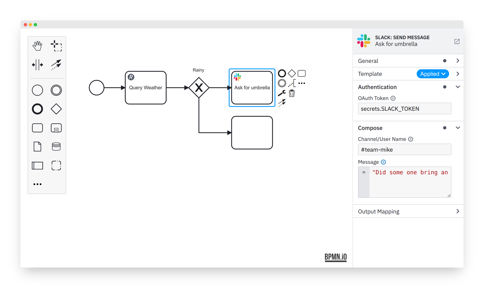

> Want to try out modeling in domain-specific, reusable building blocks? Check out [our demo](https://bpmn-io.github.io/bpmn-js-connectors-extension/?aa=1).

# Element Templates

The tool that powers declarative, domain specific modeling at [bpmn.io](https://bpmn.io/).

## About

Element templates allow you to define re-usable, domain specific building blocks to [supported bpmn.io toolkits](#supported-toolkits). Through [a set of utilities](#related-utilities) they [deeply integrate into the modeling experience](#editor-integration).




## Features

Through a [JSON document](./docs/DEFINITION.md#readme) you define different aspects of a re-usable building block.

### [General Configuration](./docs/DEFINITION.md#general)

* Name and description
* Icon
* BPMN element type
* Category
* Documentation references
* Versioning + deprecation information

### [Property Configuration](./docs/DEFINITION.md#properties)

* Type of control
* Technical binding
* Labels, description
* Validation
* Grouping
* Conditional activation criteria

### [Life-Cycle](./docs/VERSIONING.md)

* Upgrade / replace template

## Editor Integration

Through a [set of utilities](#related-utilities) element templates get deeply integrated into our editor tooling.

### Create/Append Anything

> Provided [through an extension](https://github.com/bpmn-io/bpmn-js-create-append-anything).

* Palette and context pads have a `...` entry to create / append any element
* Building blocks can be discovered via search
* Replace menu is enhanced to work using the same pattern

### Configuration

> Provided [through the properties panel](https://github.com/bpmn-io/bpmn-js-properties-panel) and a [template chooser component](https://github.com/bpmn-io/element-template-chooser).

* Allows to [set an applicable template](./docs/APPLICATION.md#readme) as well as [unlinking and removing](./docs/APPLICATION.md#readme) it
* Renders configured [template controls](./docs/PROPERTIES_EDITING.md#readme)
* Validates inputs according to defined validation rules
* Shows basic template meta-data

### Upgrading/Migration/Replacement

> Provided [through the properties panel](https://github.com/bpmn-io/bpmn-js-properties-panel) as well as [an extension](https://github.com/bpmn-io/bpmn-js-create-append-anything).

Templates come with two built-in ways of migration: _Upgrading_ to a newer (compatible) version or _deprecation_ (with the ability to display a custom message).

* Upgrading works alongside the built-in [versioning feature](./docs/VERSIONING.md#readme)
* Migration happens using the built-in [replace feature](./docs/APPLICATION.md#replace)
* Upgrade and replace will [preserve defined properties](./docs/APPLICATION.md#upgrade-behavior) on a best effort basis

The user can trigger the actual upgrade/migration/replacement operation in two ways:

* In the [properties panel](https://github.com/bpmn-io/bpmn-js-properties-panel), using provided upgrade controls
* Through the [extended replace menu](https://github.com/bpmn-io/bpmn-js-create-append-anything) by re-applying the template or switching to a different template

## Basic Setup

The basic setup requires a BPMN modeler as well as properties panel and element template provider modules:

```javascript
import BpmnModeler from 'bpmn-js/lib/Modeler';

import {
  BpmnPropertiesPanelModule,
  BpmnPropertiesProviderModule,
  ZeebePropertiesProviderModule,
  CloudElementTemplatesPropertiesProviderModule
} from 'bpmn-js-properties-panel';
```

It allows you to pass element templates to the modeler during instantiation via the `elementTemplate` configuration:

```javascript
const elementTemplates = [ ... ];

const modeler = new BpmnModeler({
  container: '#canvas',
  additionalModules: [
    BpmnPropertiesPanelModule,
    BpmnPropertiesProviderModule,
    ZeebePropertiesProviderModule,
    CloudElementTemplatesPropertiesProviderModule
  ],
  elementTemplates
});
```

Checkout [API](./docs/API.md) for advanced use-cases driven via additional APIs.


## Supported Toolkits

Right now element templates are supported in [bpmn-js](https://github.com/bpmn-io/bpmn-js).


## Creating an Element Template Provider

Refer to the [create a provider guide](./docs/CREATE_ELEMENT_TEMPLATE_PROVIDER.md#readme).


## Related Utilities

* [bpmn-js-properties-panel](https://github.com/bpmn-io/bpmn-js-properties-panel) - Provides the `ElementTemplate` core and ships with two implementation for technical property binding of [Camunda](https://camunda.com/) properties.
* [element-template-icon-renderer](https://github.com/bpmn-io/element-templates-icons-renderer) - Renders embedded element template icons on the modeling canvas.
* [element-template-chooser](https://github.com/bpmn-io/element-template-chooser) - A simple element template chooser that plugs into the properties panel
* [element-template-json-schema](https://github.com/camunda/element-templates-json-schema) - The schema definition for template descriptors
* [bpmn-js-create-append-anything](https://github.com/bpmn-io/bpmn-js-create-append-anything) - A deep integration into the core modeling experience, featuring create + append anything and replacing with template tasks
