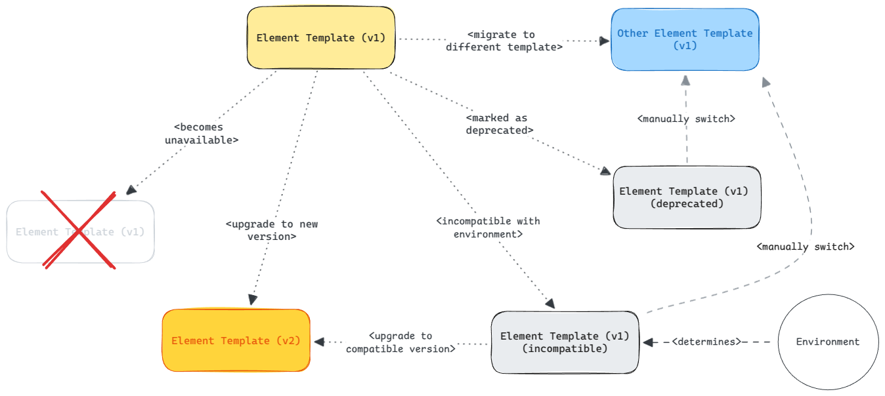

# Life-Cycle

This document outlines the set of utilities that allows you to evolve templates over time, and guide your users through changes in the custom elements they use.

## Overview

The following graphics shows different ways to evolve an element template over time.



## Evolution

Element templates offers two built-in ways of forward migration: Through [version upgrades](#upgrading-to-a-new-version) users can forward migrate to a different template version. By [replacing](#migrate-to-a-different-template) a user can switch to an entirely different building block.

[Template compatibility](#indicating-compatibility) guides users to use template versions supported in their environment.

Evolving (upgrading, downgrading or replacement) [preserves user-provided configuration](#upgrade-behavior) on a best effort basis.

> [!NOTE]
> Upgrading is user-controlled, i.e. there does not exist a [magic automatic upgrading mechanism](https://github.com/bpmn-io/design-principles#no-surprises).

### Upgrading to a new Version

Upgrading to a new template version implies that for a given template, identified through its `id`, a [new version exists](#versioning). Both templates are [known to the modeling tooling](#unavailability).

If a new template version is available then the properties panel UI will you the ability to upgrade to the new version.

The built-in [upgrade mechanism](#upgrade-behavior) ensures that compatible properties (identified by `binding`) are kept, new defaults are accounted for and so forth.

### Indicating compatibility

Similar to [upgrading](#upgrading-to-a-new-version) just so that [compatibility](#compatibility) is determined by matching configured _engines_ with requirements defined by an element template.

If the current template is incompatible in a given environment, and a compatible template is available, then the properties panel UI will suggest you to switch to that compatible version; it may very well be an older one. If no compatible version is available, then this will be indicated and the user must [resolve the issue themselves](#migrate-to-a-different-template).

During upgrading/downgrading the [upgrade mechanism](#upgrade-behavior) ensures that compatible properties (identified by `binding`) are kept, new defaults are accounted for and so forth.

Similar to [deprecated templates](#deprecation) incompatible templates will not be offered in the modeling UI.

### Migrate to a Different Template

Any time the user may choose to migrate to a different element template or, in other words _replace_ an existing custom building block with a different one.

The built-in [replace mechanism](#upgrade-behavior) ensures that compatible properties (identified by `binding`) are kept, new defaults are accounted for and so forth.

Migration is usually what you'd recommend your users as you [deprecate a template](#deprecation).

### Deprecation

You may mark an element template as deprecated, and a respective hint will be shown in the properties panel. In addition the template won't be offered to your users from the modeling UI.

#### `deprecated` property

Marking your template as deprecated works by attaching a `deprecated` property to the template:

```json
{
  "$schema": "https://unpkg.com/@camunda/zeebe-element-templates-json-schema/resources/schema.json",
  "name": "My Custom Task (deprecated)",
  "id": "my.custom.task",
  "deprecated": {
    "message": "Migrate to My Other Custom Task",
    "documentationRef": "https://localhost/migrate-to-other"
  },
  ...
}
```

### Unavailability

In order for the modeling stack to work with templates these _must be available_. This applies both for using templates (applying them, showing custom properties) but also for upgrading from or to a certain template.

If a template is unavailable (i.e. a template with a given `id` and `version` combination is not known) then a descriptive message is shown in the properties panel. The user can unlink to view technical properties _or_ [migrate to a different template](#migrate-to-a-different-template).

## Versioning

Template versioning is an important cornerstone of safe template evolution. If a new version of a template is detected then the user gets the ability to [upgrade](#upgrading-to-a-new-version) to it.

To support forward migration, the modeler UI will offer only the latest version of a template to users for choosing.

#### `version` property

Versioning your templates is as simple as attaching a `version` property to it. Typically that is a number that increments.

```json
{
  "$schema": "https://unpkg.com/@camunda/zeebe-element-templates-json-schema/resources/schema.json",
  "name": "My Custom Task",
  "id": "my.custom.task",
  "version": 1
  ...
}
```

> [!TIP]
> If you ship element templates to your users through files then you'd want to make sure that new versions of a template do not override old versions. A simple way to accomplish this is to organize templates in a single template per file fashion and encode the template version in the file name:
>
> ```plain
> └── element-templates
>     ├── my-custom-task-1.json
>     ├── my-custom-task-2.json
>     └── ...
> ```

## Compatibility

Compatibility matches [environment constraints](#engines-configuration) with [requirements expressed](#engines-property) in an element template.

It allows template authors to express which template shall be used in a particular environment. It allows users to choose compatible building blocks, thus preventing surprises during template use and later execution.

#### `engines` property

A template author can express environmental constraints throught he `engines` property:

```json
{
  "$schema": "https://unpkg.com/@camunda/zeebe-element-templates-json-schema/resources/schema.json",
  "name": "My Custom Task",
  "id": "my.custom.task",
  "engines": {
    "camunda": "^7"
  },
  ...
}
```

This will be matched with [actual engines configuration](#engines-configuration) to determine compatibility.

#### Engines configuration

Element templates get their environment through [the API](./API.md#elementtemplatessetenginesengines-recordstring-string-void) or via upfront setup via the `elementTemplates.engines` configuration.

Once set (or changed), templates will be [checked against compatibility](#indicating-compatibility).

## Upgrade Behavior

Upgrading, either through [replace](#migrate-to-a-different-template) or [update](#upgrading-to-a-new-version) preserves existing user-provided data on a best effort basis.

Matching properties for both templates are identified through their _technical binding_.

Properties that contain user changes are kept, new defaults are applied, and properties that do not exist in the new template are discarted.

---

See also [application](./APPLICATION.md).
